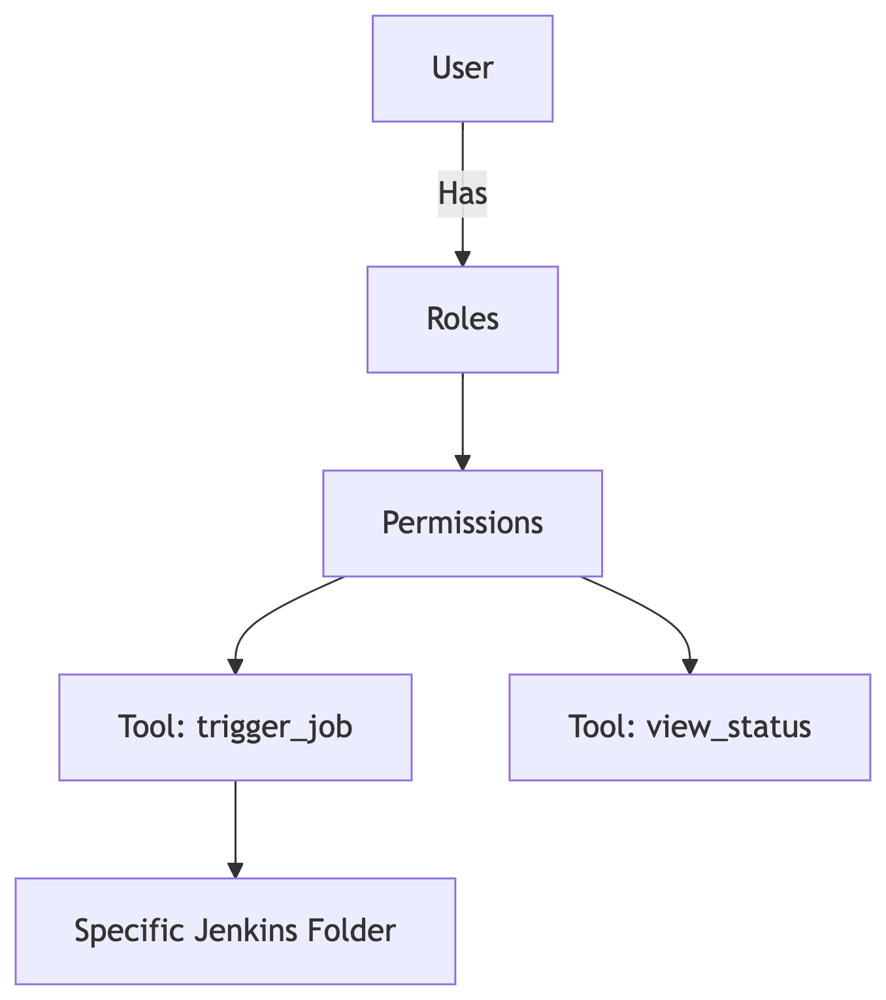
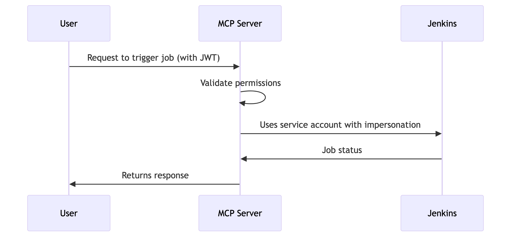

# Authentication & Authorization for MCP Server

A robust authentication and authorization architecture for your Jenkins-related MCP server, especially in a production environment with per-user access control and AI agents, should follow a **layered approach**. This design ensures security at every point of interaction and aligns with best practices for both MCP and Jenkins.

Here is a recommended architecture based on your requirements:

### 1. Authentication Layer: Identify the User and Agent

This first layer establishes who is making the request. It must be independent of your MCP tools and should validate the incoming request's identity.

* **Implement OAuth 2.0:** This is the recommended standard for MCP authentication. Your MCP server should be configured to accept and validate tokens issued by an external Identity Provider (IdP) or an OAuth 2.0 authorization server.
* **Token Validation:** Use a middleware or a request hook in your FastMCP server to check for a `Bearer` token in the `Authorization` header of every incoming request. The validation process should include:
    * **Signature and Expiration:** Ensure the token is valid, hasn't expired, and was signed by a trusted authority (your IdP).
    * **Audience Claim:** Verify that the token's `aud` (audience) claim matches your MCP server's identifier, ensuring the token was intended for your service.
    * **Extract User Identity:** After validation, extract the user's identity (e.g., username or user ID) from the token's claims. This identity is crucial for the next authorization step.

### 2. Authorization Layer: Enforce Access Control

This layer determines what the authenticated user is allowed to do. It should be tightly integrated with your Jenkins instance to support your per-user access control requirements.

* **Per-Tool Authorization Check:** For sensitive tools like `trigger_job`, use an **authenticator** or a similar function attached to the tool decorator. This function will receive the user's identity from the authentication layer.
* **Integrate with Jenkins Permissions:** The authenticator for your Jenkins tools should make a call to the Jenkins API to check the authenticated user's permissions for the specific Jenkins resource (e.g., a job within a folder).
    * **Example for `trigger_job`:** When a request comes to trigger a job in `folder_A`, the authorization logic should check if the user has `Job/Build` permission on that specific `folder_A`. If the user lacks this permission, the tool invocation should be denied, and the server should return a `403 Forbidden` error.
* **Role-Based Access Control (RBAC) for Default Tools:** For non-sensitive, read-only tools, you can implement a simpler RBAC model.
    * **Allow All Authenticated Users:** Create a policy that allows any successfully authenticated user (regardless of their specific role or Jenkins permissions) to access tools like `get_current_time_info` or `list_all_jobs`.
    * **"Guest" Role:** You could even create a "guest" role for unauthenticated requests, allowing them to access a public `health` check tool, for example.

### 3. Architecture Overview

Here's how the different components fit together:

1.  **AI Agent (e.g., Copilot)** or **MCP Client:** The agent makes a request to your MCP server. It's configured with the user's OAuth access token.
2.  **MCP Server:**
    * **Authentication Middleware:** The server receives the request and, before routing it to any tool, a middleware intercepts it to validate the OAuth access token.
    * **Authorization Logic:** If the token is valid, the server extracts the user's identity. When a tool like `trigger_job` is invoked, the authorization logic queries the Jenkins API using the user's identity and the job's path.
    * **Jenkins API:** This is your source of truth for all permissions. The Jenkins API returns whether the user has the required access.
    * **Response:**
        * If the user is **authorized**, the MCP server executes the `trigger_job` tool and returns a success response.
        * If the user is **unauthorized**, the MCP server immediately returns a `403 Forbidden` response.
        * If the token is **invalid or missing**, the server returns a `401 Unauthorized` response with a metadata URL for the client to initiate the OAuth flow.

### Key Implementation Details

* **Jenkins API Tokens:** For your MCP server to interact with Jenkins on behalf of a user, it's a best practice to use **Jenkins API tokens** generated for each user. This avoids using passwords and provides a more secure, revocable credential.
* **Confused Deputy Problem:** Your design must mitigate the "confused deputy" problem. The MCP server is the "deputy" that can be confused into performing an action with its own elevated privileges on behalf of a user with lower privileges. The architecture outlined above prevents this by always checking the user's specific permissions against the target resource in Jenkins, ensuring the server acts only with the delegated authority of the user.
